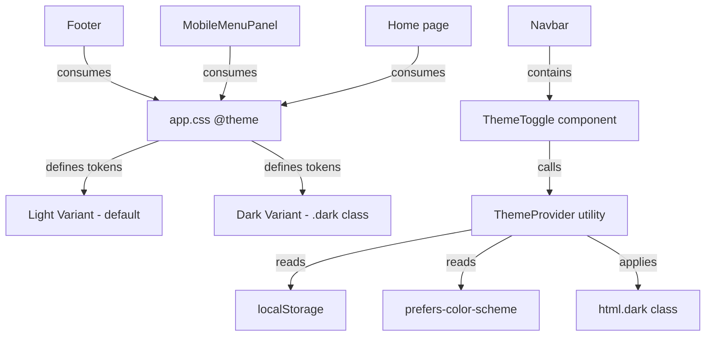

# Design Document: Minimalist Theme

## Overview

This design replaces the existing Manaprobe brand color scheme (purple/blue gradients derived from logo assets) with a minimalist, neutral design system supporting both light and dark variants. The implementation leverages Tailwind CSS v4's `@theme` directive for token definitions and uses a class-based dark mode strategy (`dark` class on `<html>`) combined with `prefers-color-scheme` media query detection for automatic theme application.

The approach centers on:
1. Redefining CSS custom properties in `app.css` using neutral grayscale tokens
2. Adding a `ThemeToggle` component to the Navbar
3. A small theme utility module that manages localStorage persistence and system preference detection
4. Updating all components to use the new semantic tokens exclusively

## Architecture



### Theme Resolution Order

1. Check `localStorage` for persisted preference (`theme` key)
2. If found, apply that preference (add/remove `dark` class)
3. If not found, check `window.matchMedia('(prefers-color-scheme: dark)')`
4. Listen for system preference changes via `matchMedia.addEventListener('change', ...)`

### Dark Mode Strategy

Tailwind CSS v4 supports a class-based dark mode via the `@variant dark` selector. We define two sets of token values:
- Default (light) tokens in `@theme`
- Dark tokens scoped under `.dark` selector using CSS custom properties

This allows instant switching by toggling the `dark` class on `<html>` without a page reload.

## Components and Interfaces

### 1. Theme Utility Module (`app/utils/theme.ts`)

```typescript
export type Theme = 'light' | 'dark';

const STORAGE_KEY = 'theme';

/** Get the resolved theme: stored preference > system preference > 'light' */
export function getResolvedTheme(): Theme {
  const stored = localStorage.getItem(STORAGE_KEY);
  if (stored === 'light' || stored === 'dark') return stored;
  if (window.matchMedia('(prefers-color-scheme: dark)').matches) return 'dark';
  return 'light';
}

/** Apply theme to document root */
export function applyTheme(theme: Theme): void {
  document.documentElement.classList.toggle('dark', theme === 'dark');
}

/** Persist theme choice */
export function persistTheme(theme: Theme): void {
  localStorage.setItem(STORAGE_KEY, theme);
}

/** Subscribe to OS preference changes. Returns cleanup function. */
export function onSystemThemeChange(callback: (theme: Theme) => void): () => void {
  const mq = window.matchMedia('(prefers-color-scheme: dark)');
  const handler = (e: MediaQueryListEvent) => callback(e.matches ? 'dark' : 'light');
  mq.addEventListener('change', handler);
  return () => mq.removeEventListener('change', handler);
}
```

### 2. ThemeToggle Component (`app/components/ThemeToggle.tsx`)

```typescript
interface ThemeToggleProps {
  className?: string;
}
```

- Renders a button with sun/moon SVG icon
- Displays sun icon when dark mode is active (indicating "switch to light")
- Displays moon icon when light mode is active (indicating "switch to dark")
- Includes `aria-label` describing current state (e.g., "Switch to light theme")
- On click: toggles theme, persists to localStorage, applies to document

### 3. Updated Navbar

- Adds `<ThemeToggle />` between desktop nav links and hamburger button
- Visible on all viewport sizes (320px–1920px)

### 4. Updated Footer

- Replaces `bg-brand-dark`, `text-text-on-brand`, `text-brand-light/80` with neutral semantic tokens
- Uses `bg-neutral-900 dark:bg-neutral-950` pattern or equivalent token references

### 5. Updated MobileMenuPanel

- Replaces `border-brand-light`, `bg-brand-accent/10`, `text-brand-accent` with neutral tokens
- Active state uses accent token instead of brand-accent

### 6. Updated Home Page Sections

- Hero: solid neutral background instead of gradient
- Screenshot section: neutral light background
- Features highlight: neutral card backgrounds

## Data Models

### Color Token Schema

| Semantic Role | Light Value | Dark Value | Usage |
|---|---|---|---|
| `--color-surface` | `#FAFAFA` | `#111111` | Page/section backgrounds |
| `--color-surface-alt` | `#F3F4F6` | `#1A1A1A` | Card/panel backgrounds |
| `--color-text-primary` | `#111827` | `#F9FAFB` | Headings, body text |
| `--color-text-secondary` | `#6B7280` | `#9CA3AF` | Muted text, captions |
| `--color-accent` | `#111827` | `#F9FAFB` | Links, buttons, focus rings |
| `--color-border` | `#E5E7EB` | `#2D2D2D` | Borders, dividers |
| `--color-surface-dark` | `#111111` | `#111111` | Footer background (both modes) |
| `--color-text-on-dark` | `#F9FAFB` | `#F9FAFB` | Text on dark surfaces |

### Contrast Ratios (Verified)

| Pair | Ratio | WCAG Level |
|---|---|---|
| Light: text-primary (#111827) on surface (#FAFAFA) | 17.4:1 | AAA |
| Light: text-secondary (#6B7280) on surface (#FAFAFA) | 5.5:1 | AA |
| Dark: text-primary (#F9FAFB) on surface (#111111) | 17.1:1 | AAA |
| Dark: text-secondary (#9CA3AF) on surface (#111111) | 7.5:1 | AA |
| Dark: border (#2D2D2D) on surface (#111111) | 1.8:1 | ≥1.5:1 ✓ |

### localStorage Schema

| Key | Type | Values | Purpose |
|---|---|---|---|
| `theme` | `string` | `'light'` \| `'dark'` | Persisted user preference |

## Correctness Properties

*A property is a characteristic or behavior that should hold true across all valid executions of a system — essentially, a formal statement about what the system should do. Properties serve as the bridge between human-readable specifications and machine-verifiable correctness guarantees.*

### Property 1: Theme resolution priority

*For any* combination of stored theme preference (present or absent) and system color scheme preference (light or dark), `getResolvedTheme()` SHALL return the stored preference when one exists in localStorage, and SHALL return the system preference when no stored preference exists, defaulting to `'light'` when neither is available.

**Validates: Requirements 2.6, 3.6, 4.4, 4.5**

### Property 2: Theme persistence round-trip

*For any* valid theme value (`'light'` or `'dark'`), calling `persistTheme(theme)` followed by reading `localStorage.getItem('theme')` SHALL return the same theme value that was persisted.

**Validates: Requirements 4.3**

### Property 3: Theme application idempotence

*For any* theme value, calling `applyTheme(theme)` multiple times SHALL produce the same DOM state as calling it once — specifically, `document.documentElement.classList.contains('dark')` SHALL equal `theme === 'dark'` after any number of applications.

**Validates: Requirements 4.2**

## Error Handling

### Theme Utility Errors

| Scenario | Handling |
|---|---|
| `localStorage` unavailable (private browsing, quota exceeded) | Catch exception in `persistTheme()`, fall back to in-memory state. `getResolvedTheme()` treats missing storage as "no preference" and uses system preference. |
| `localStorage` contains invalid value (not 'light' or 'dark') | `getResolvedTheme()` ignores the invalid value and falls back to system preference detection. |
| `window.matchMedia` unavailable (SSR) | Guard with `typeof window !== 'undefined'` check. Default to `'light'` during server-side rendering. |
| Theme toggle clicked rapidly | `applyTheme()` is idempotent — multiple rapid calls converge to the final state without visual glitches. |

### CSS Token Resolution Errors

| Scenario | Handling |
|---|---|
| Missing CSS custom property | Tailwind CSS v4 resolves tokens at build time. Missing tokens cause build errors caught during development. |
| Browser doesn't support CSS custom properties | All modern browsers support them. No fallback needed (project targets modern browsers per React Router v7 requirements). |

## Testing Strategy

### Unit Tests (Example-Based)

Unit tests verify specific scenarios and edge cases:

1. **Color token validation**: Verify each defined token meets its HSL/luminance constraints (Requirements 2.1–2.5, 3.1–3.5)
2. **Contrast ratio verification**: Calculate and assert WCAG AA compliance for all text/background pairs (Requirements 2.7, 3.2–3.4, 5.7, 7.5, 8.1–8.7)
3. **ThemeToggle rendering**: Verify correct icon display for each state, aria-label presence, keyboard operability (Requirements 4.6, 4.7)
4. **Hero section rendering**: Verify solid background, no gradient (Requirements 6.2, 6.4)
5. **Component token usage**: Verify no hardcoded colors in component source (Requirements 5.1–5.3)
6. **CSS audit**: Verify no brand tokens or gradients remain (Requirements 1.1, 6.1, 6.3)

### Property-Based Tests

Property tests verify universal correctness across generated inputs using `fast-check`:

- **Library**: `fast-check` (already in devDependencies)
- **Minimum iterations**: 100 per property
- **Tag format**: `Feature: minimalist-theme, Property {number}: {property_text}`

| Property | What's Generated | What's Verified |
|---|---|---|
| Property 1: Theme resolution priority | Random combinations of: stored preference (present/absent/invalid), system preference (light/dark/unavailable) | `getResolvedTheme()` returns correct value per priority rules |
| Property 2: Theme persistence round-trip | Random valid theme values | `persistTheme(t)` then `localStorage.getItem('theme')` === `t` |
| Property 3: Theme application idempotence | Random theme values, random number of applications (1–10) | DOM state after N applications equals DOM state after 1 application |

### Integration Tests

1. **System preference change**: Simulate `matchMedia` change event, verify theme updates without reload (Requirements 3.7, 5.4–5.6)
2. **Full toggle flow**: Click toggle → verify class change → reload → verify persistence (Requirements 4.2–4.4)
3. **Build verification**: Run `react-router build` and verify no unresolved class errors (Requirement 1.3)

### Smoke Tests

1. **No brand tokens in output**: Grep built CSS for banned hex values and token names (Requirement 1.1)
2. **Font consistency**: Verify Inter is the only font-family in both variants (Requirement 7.2)

